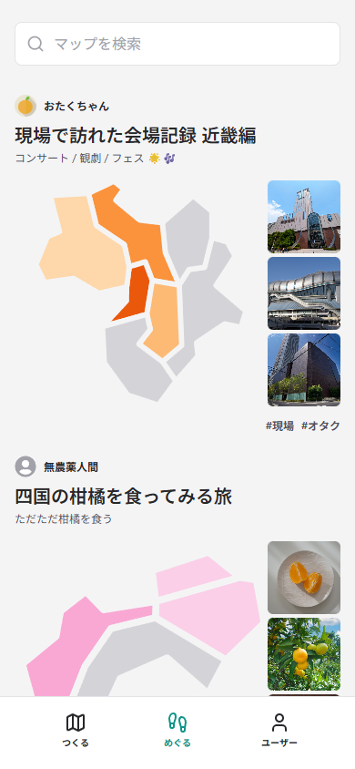
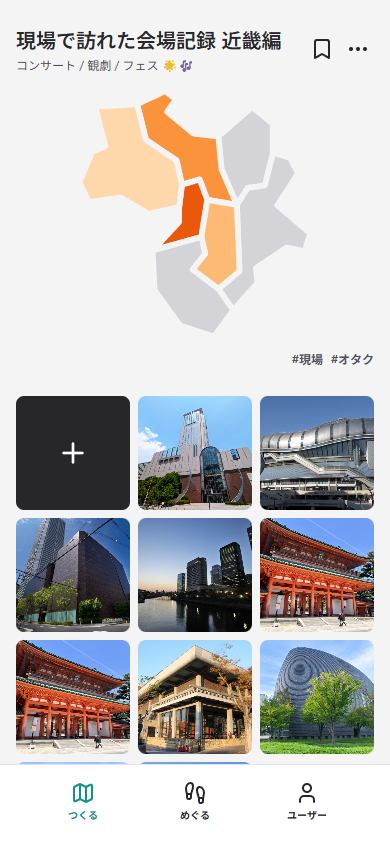
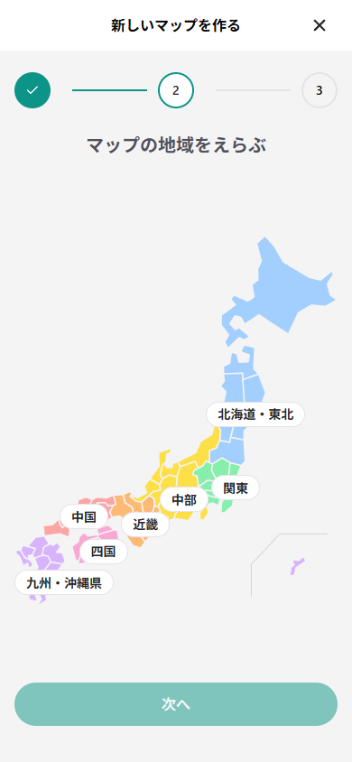
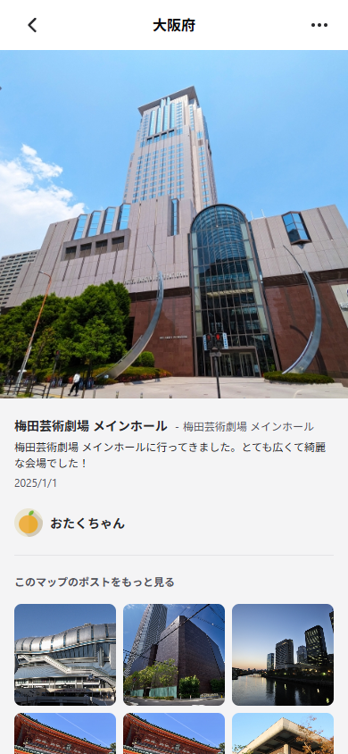
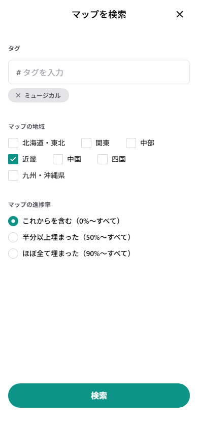

# Map-rally

## 概要

旅行の記録、コンサートやラーメン巡りの軌跡、いつもの街での発見まで。好きなテーマで「マップ」を作り、訪れた場所の写真を「ポスト」することで、自分だけの地図に色を塗り重ねることができるサービスです。

## サービスについて

### 1. 「マップ」をつくろう

ユーザーは、日本の 7 つの地方いずれかをベースにした「マップ」を作成します。好きな名前をつけたり、発見してもらいやすいタグをつけたりして、マップらしさをアピールできます。

 

### 2. 写真を「ポスト」しよう

ユーザーは、それぞれのマップに写真を「ポスト」できます。ポストには、マップに該当する都道府県を紐づけることで、マップが少しずつ色づいていきます。あなただけの記録を塗り重ねていきましょう。

### 3. マップをさがしてみよう

ユーザーは、つけられたタグや、地方、ポストの進捗率などから、マップを検索することができます。

## 想定している機能

- SNS 連携
  - マップおよびポストを作成した際に SNS で共有できる
  - マップを画像で出力し、進捗状況を SNS で記録・共有できる
- マップ配布
  - マップのプリセットを作成・配布でき、読み込んだユーザーがそれぞれにマップを作成できる
    - 企業・行政などがユーザーに配布し、クエスト的な遊び方をしてもらうことができる
    - QR コード等で読み込むことができる
- マップアナリティクス
  - マップの進行状況の記録をグラフで確認できる
