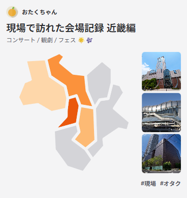
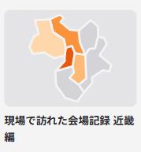
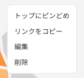
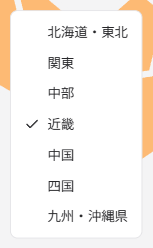

# 基本設計書

## コンポーネント一覧

| 番号 | 名前                                    | 画像                                       |
| ---- | --------------------------------------- | ------------------------------------------ |
| 1    | ナビゲーション                          |   |
| 2    | カード (Large)                          |   |
| 3    | カード (Small)                          |   |
| 4    | タグ (テキストあり)                     |     |
| 5    | タグ (テキストなし)                     |     |
| 6    | ユーザーアイコン (Small, Medium, Large) |    |
| 7    | ユーザーバナー                          |  |
| 8    | メニュー                                |         |
| 9    | ラジオメニュー                          |   |
