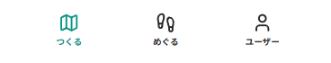
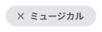
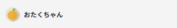

# 基本設計書

## コンポーネント

| 番号 | 名前                                    | 画像                                       |
| ---- | --------------------------------------- | ------------------------------------------ |
| 1    | ナビゲーション                          |   |
| 2    | カード (Large)                          |   |
| 3    | カード (Small)                          |   |
| 4    | タグ (テキストあり)                     |     |
| 5    | タグ (テキストなし)                     |     |
| 6    | ユーザーアイコン (Small, Medium, Large) |    |
| 7    | ユーザーバナー                          |  |
| 8    | メニュー                                |         |
| 9    | ラジオメニュー                          |   |

## 画面

| 番号 | 名前                       | 画像                                 |
| ---- | -------------------------- | ------------------------------------ |
| 1    | ホーム                     |        |
| 2    | 検索                       |      |
| 3    | 設定                       |     |
| 4    | ユーザー                   |        |
| 5    | マップ詳細                 |         |
| 6    | ポスト詳細                 |        |
| 7    | マップ作成-1               |  |
| 8    | マップ作成-2               |  |
| 9    | マップ作成-3               |  |
| 10   | マップ作成-4               |  |
| 11   | ポスト作成                 | \-                                   |
| 12   | マップ編集                 | \-                                   |
| 13   | ポスト編集                 | \-                                   |
| 14   | プロフィール設定           | \-                                   |
| 15   | 自分の投稿一覧             | \-                                   |
| 16   | ブックマークしたマップ一覧 | \-                                   |
| 17   | ユーザー設定               | \-                                   |
| 18   | いいねしたマップ一覧       | \-                                   |
| 19   | ブロックしたユーザー一覧   | \-                                   |
| 20   | お問い合わせ               | \-                                   |

## ダイアログ

| 番号 | 名前                 | 画像                               |
| ---- | -------------------- | ---------------------------------- |
| 1    | マップ検索           |  |
| 2    | タグ追加             |     |
| 3    | ポスト削除確認       | \-                                 |
| 3    | ユーザーブロック確認 | \-                                 |
